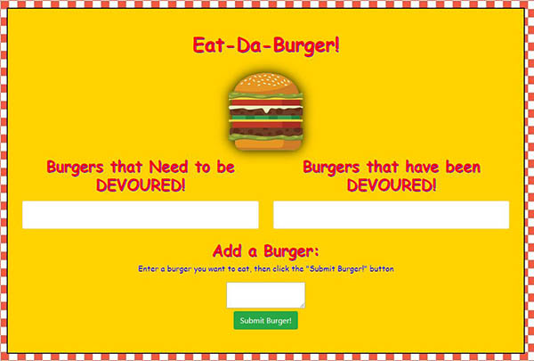
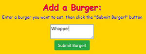
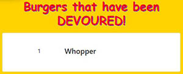

# Burger Logger
Unit 13 assignment

##Outline
The Burger Logger is an application designed with MySQL, Node, Express, Handlebars and a homemade ORM. Node and MySQL was used to query and route data in the app, and Handlebars was used to generate the HTML.

##Links
####Github Repository:
* [https://github.com/bkarulas/burger](https://github.com/bkarulas/burger)
####Applicatin Link
* [https://damp-shore-66568.herokuapp.com](https://damp-shore-66568.herokuapp.com/)

##Application

* This is a restaurant application that lets users input the names of burgers they'd like to eat.

* Whenever a user submits a burger's name, the application will display the burger on the left side of the page -- waiting to be devoured.

* Each burger in the waiting area also has a  button. 

* When the user clicks it, the burger will move to the right side of the page.

